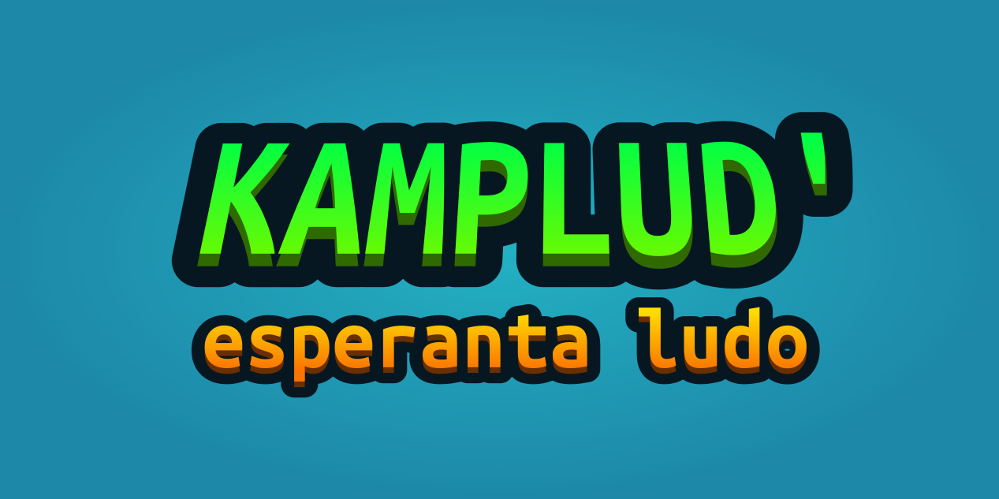

# KAMPLUD'

Ĉi tio estas esperantlingva testa 3D-saltludo, kreita en Bevy-ludmotoro per rustlingvo.

Ĝi estas malfermfonta kaj estas disvastigata je la Apache-permesilo.

## Taskolisto
### Ĉefaj
- [x] GLTF-scena ŝargado kaj kunpuŝiĝo
- [x] Orbita kamerao
- [x] Ĉefmenuo 
- [x] `Coin` scena komponanto
- [x] `Finish` scena komponanto
- [x] `DamageTrigger` scena komponanto ~~(ludo kraŝas enigante ian ajn kunpuŝiĝilon kun alta rapideco) ([#184](https://github.com/dimforge/bevy_rapier/issues/184))~~
- [ ] Realigi ludan `Health` komponanton
- [x] Ripari saltadon de ludanto
- [ ] Limigi kameraan turnadon
- [x] `InGame` uzanta interfaco
- [ ] `GameOver` kaj `Win` statoj
- [ ] Realigi multludantaron kaj poentarojn

### Pliaj
- [ ] Krei ĉefajn ludajn nivelojn
- [ ] Interscena ŝargilo
- [ ] Eniri la menuon el la `InGame` stato
- [ ] Muziko
- [ ] Krei ĉefmenuan scenon
- [x] `Discord Rich Presence` (realigebla, sed haltigas la ludon sen lanĉita Diskordo) ([#3](https://github.com/jewlexx/discord-presence/issues/3))

### Refari
- [x] Repripensi GLTF-kunpuŝiĝilan sistemon (parenco-ido)
- [x] Unuigi `Handle<Mesh>`, `Collider` and `GltfExtras` komponantojn
